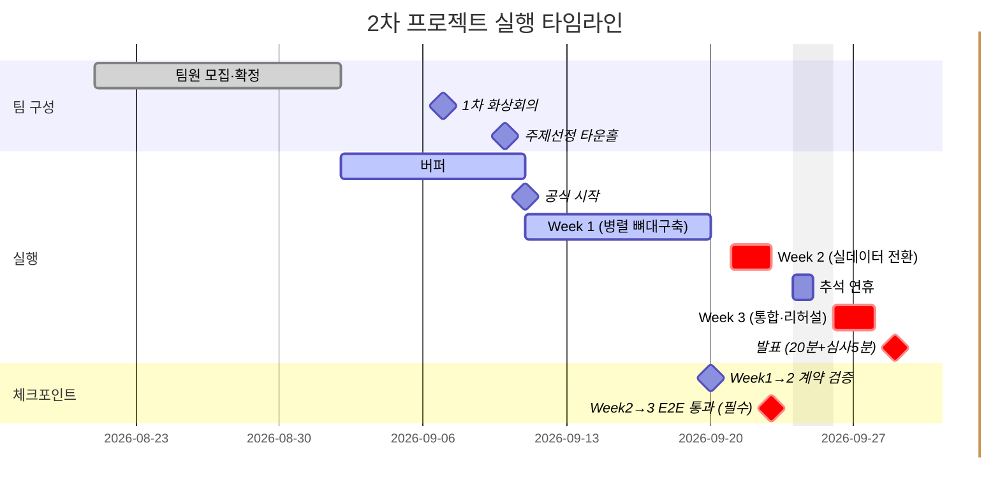

> 관련 문서: [[1-kickoff-brief]] · [[22-feature-spec]] · [[3-feature-backlog]]
> **현재 상태(2026-09-17)**: 역할 리드 체제 — 나경(PM) / 최민(개발자 리드) / 임현제(ML·RAG·LLM 리드) / 박형준(간헐적 서브개발자). 이 문서는 **지금 기준 계획만** 담는다 — "누가 언제 뭐라고 정정했는지"의 변경 이력은 [[4-changelog]]와 [[00-wbs/04-daily-logs/index|데일리로그]]에 있으니 여기서는 반복하지 않는다.

## 0. 왜 이 문서가 필요한가
4개 영역(데이터·인프라 / ML·모델링 / RAG·자동화 / 대시보드·프론트)이 실질적으로 약 2.5주(9/11~9/28, 추석 이틀 제외) 동안 동시에 움직인다. [[22-feature-spec]] 1절의 크로스커팅 계약(Dataverse 스키마·데이터 흐름 순서)만 지키면 서로 안 보고 일해도 맞물리게 설계돼 있지만, "정말 맞물리는지" 확인할 시점을 미리 못박아두지 않으면 마지막 주에 가서야 어긋난 걸 발견하는 사고가 난다. 이 문서는 (1) 실제 날짜에 맞춘 영역별 계획과 (2) 그걸 어떻게 체크할지를 함께 정리한다.

## 0-1. 실제 캘린더 매핑
| 구간 | 날짜 | 비고 |
| --- | --- | --- |
| 팀 최종 확정 | 9/2(수) | 학교 공식 마감 |
| 버퍼 | 9/2 ~ 9/10 | 팀원 확정 직후 준비 기간 — [[00-wbs/03-meetings/2026-09-07-kickoff-call]] |
| 주제선정 타운홀 | 9/10(목) | 학교 공식 행사 — [[00-wbs/03-meetings/2026-09-10-townhall]] |
| **Week 1** | 9/11(금, 공식 시작) ~ 9/20(일) | **9/14(월) 대표님 주제 멘토링** + 9시간 수업(지각·조퇴 기준 14:30) |
| **Week 2** | 9/21(월) ~ 9/23(수) | 9/21·22 9시간 수업, 9/23 4시간 수업(출결 종료 12:45) — **추석 전 마감** |
| 추석 연휴 | 9/24~25 | 작업 없음으로 가정 |
| **Week 3** | 9/26(토) ~ 9/28(월) | 9/28 9시간 수업이 마지막 준비일 |
| 발표 | 9/29(화) | 타운홀, 팀별 20분 발표 + 심사 5분, 시간초과 시 중단 |

**Week 2가 원래 계획보다 짧다(7일→3일)** — 추석 연휴가 통합 직전에 끼어 있어서, Week 2 안에 실데이터 전환과 1차 E2E 통과를 못 끝내면 Week 3에 만회할 시간이 사실상 없다. 체크포인트가 9/23에 몰려있는 이유.

### 참고 — 9/14 대표님 주제 멘토링 (운영국 공지, 윤봉현 멘토)
예산/비용 주의: 팀 리소스 그룹 예산 알림 이메일 등록은 [[23-cost-plan]] 참고 — Databricks 실사용 시작하면 추가 리소스 그룹이 생겨서 별도 과금되니 특히 주의.

## 0-2. 팀 구성
| 담당자 | 역할 | 책임 영역 |
| --- | --- | --- |
| 나경 | **PM** | 프로젝트 총괄(크로스커팅 계약 관리·체크포인트 운영·블로커 해소), 발표자료([[82-ppt-plan]]). 손이 비는 곳은 직접 스켈레톤을 만들어 막아두기도 함(RAG Power Automate 뼈대, 초기 대시보드 목업) — 상시 담당자는 아님 |
| 최민 | **개발자 리드(Dev Lead)** | 40.Data Pipeline(Data Factory·Dataverse) + `FashionAI.Api` 백엔드 + 대시보드·프론트엔드(70번) + 앱 연동(MAUI) + 개발서버 — 사실상 풀스택 1인 |
| 임현제 | **ML·RAG·LLM 엔지니어 리드** | 50.ML·모델링 + 60.RAG·자동화(LLM 엔지니어링 포함) 단독 담당 |
| 박형준 | **서브 개발자(간헐적 참여)** | 상시 담당 영역 없음, 필요시 요청해서 지원받는 인력 |

**참고할 것**:
- 대시보드: 나경이 9/10 만든 ASP.NET Core MVC 스캐폴딩은 아카이빙됨(다른 개발환경 기준 목업) — **✅ 9/17 밤 GitHub 직접 확인**: 최민이 만드는 건 웹 대시보드가 아니라 **.NET MAUI 앱**(홈·승인이력·예측대조·데이터조회·협업허브·인증 6페이지, "설정" 없음), 서비스는 전부 Mock으로 실 데이터 미연동, 커밋은 9/15 1개뿐(9/16~17 보고분 미반영). 상세는 [[72-dashboard-spec]](이 문서도 갱신 필요).
- RAG: 코어(Adaptive Card+Power Automate)는 나경이 PM으로서 만든 뼈대. **✅ 9/17 저녁 업데이트 — 임현제가 구조화 데이터 기반 RAG 프로토타입(발주근거·위험도·추천발주량 자연어 질의) 완료 보고**(본인 독자 작업, 아래 [[64-work-order-genai-stretch]]와는 무관). ⚠️ 확인 필요: 이게 [[21-system-model]]/[[64-work-order-genai-stretch]]가 명시한 "실제 RAG 챗봇은 스코프에 없음, 카드에 붙는 한 줄 설명만" 원칙과 어떻게 부합하는지.
- [[64-work-order-genai-stretch]]는 임현제가 아니라 **박형준에게 할당하려고 나경이 만든 작업지시서**임(9/17 저녁 정정, 오전에 "임현제 담당"으로 잘못 정정했던 것 취소). **✅ 진행중 확인(9/17 밤)**: Step A(근거데이터 조회) 중 판매속도·재고소진일 vs 리드타임 쿼리 작성 완료(계절민감도 계수·임박 프로모션 유무는 미완료), Step B(프롬프트·스키마 설계) LLM 프롬프트 테스트 완료. ⚠️ 문서상 "9/23 코어 통과 후에만 착수" 조건보다 먼저 시작됨 — 코어 작업에 지장 없는지 확인 필요.
- 임현제 트랙: **더 이상 "실질 착수 전"이 아님(9/17 저녁 갱신)** — Databricks가 Blob 기반으로 SKU별 재고·위험도·추천발주량을 실제로 계산, `reorder_point`는 520개 SKU 전체에서 정책값과 일치 검증 완료, 고위험 추천 3건은 Dataverse에 실제 적재까지 됨. 자기보고 기준이라 규모 확대(3건→전체 SKU)와 안정성은 재확인 필요.
- 데이터 소스: **확정(9/17)** — Databricks는 Blob Storage 기반. `nqnqdb`(SQL Server)는 별개 용도로 최민이 APP 테이블(계정/승인발주/채팅) 생성 완료 — Databricks 파이프라인과 헷갈리지 말 것. 계정 제외 누적 캐시 데이터라 비용 확인 필요(최민 지적).
- PowerBI: **최종 불가 판정(9/17, 최민)** — 열린 질문이었던 것 종료, [[3-feature-backlog]] Tier 2 백로그 그대로.
- **LLM 호출 방식(신규, 9/17 밤)**: 임현제가 RAG 프로토타입에서 **Azure AI Foundry 모델 배포 + API Key 직접 호출**을 이미 쓰고 있음 — 원래 "Azure OpenAI, 리소스 미생성"으로 알려져 있던 게 실제로는 이미 진행돼 있었음. [[25-execution-design]] 2-2절의 "호출 위치(Power Automate 커넥터 vs FashionAI.Api 엔드포인트)" 논의에 3번째 실사용 옵션으로 추가해야 함. Azure AI Foundry는 학교 공식 커리큘럼 7개 항목에 정확히 이름이 올라있어([[2-tech-research]] 2-4절) 오히려 "Azure OpenAI"보다 학습내용 적합성이 좋음. ⚠️ [[23-cost-plan]]에 이 비용이 전혀 반영 안 돼 있었음 — 확인 필요.
- 박형준: 할당된 작업이 진행이 안 돼서 나경이 대신 떠안을 가능성 있음(9/17 저녁 기준).

> 롤별 상세 작업은 아래 1절 표 참고 — 여기 간트차트는 전체 일정의 모양만 보여준다.

## 1. 롤별 주차별 계획

| 영역 | 담당자 | Week 1 (9/11~9/20) | Week 2 (9/21~9/23) | Week 3 (9/26~9/28) |
| --- | --- | --- | --- | --- |
| 데이터·인프라 | 최민 | Mock 데이터셋 준비 ✅ · Dataverse `ReorderRecommendation` 테이블 생성 ✅(나경 대행) · Security Role은 백로그 이동(재검토 없음) · Entra ID/MSAL 로그인 진행중 · `nqnqdb` APP 테이블(계정/승인발주/채팅) 생성 ✅(9/17, 비용 확인 필요) · PowerBI 연동 ❌ 최종 불가(9/17) | nqnq.db 실데이터로 배치 전환(cutoff 8/20), ML 결과 Dataverse 적재 테스트 | held-out 데이터 최종 고정, 스키마 동결 + 예외 케이스 점검 |
| 데이터·인프라(자동화) | 최민 | 실시간 데이터 자동생성 모듈 진행중(9/10~) — [[42-work-order-choimin]] 4절 | 실 Dataverse 이벤트로 전환 | 시연용 파라미터(주기·건수) 최종 조정 |
| ML·모델링 | 임현제 | ✅ Blob 기반 SKU별 재고·위험도·추천발주량 산출, `reorder_point` 520개 SKU 전체 정책값 일치 검증(9/17 보고) · ✅ Azure AI Foundry 모델 배포+API Key 호출로 LLM 인프라 확보(9/17 밤) | 고위험 추천 3건 Dataverse 실적재(진행중, 9/17) → 전체 SKU 확대, 오차율 계산 | 예측 vs held-out 오차율 계산 스크립트 |
| RAG·자동화 | 임현제 (코어는 나경 작업분) | ✅ Adaptive Card+Power Automate 트리거 완료(나경, 9/16) · ✅ 구조화 데이터 RAG 프로토타입 완료(임현제, 9/17, Azure AI Foundry 기반) | ✅ 실 Dataverse 이벤트 연동 완료(나경, 9/16) | 승인 플로우 리허설, GenAI 스트레치는 [[64-work-order-genai-stretch]](**박형준 담당**, 진행중 9/17 — Step A 일부·Step B 완료, 9/23 통과 전 조기 착수됨) |
| 대시보드·프론트 | 최민 (구 스캐폴딩은 나경 작업분, 아카이빙) | ⚠️ 9/17 밤 GitHub 직접 확인 — 실제로는 **웹이 아니라 .NET MAUI 앱**(홈·승인이력·예측대조·데이터조회·협업허브·인증 6페이지, "설정" 탭은 존재 안 함). 서비스는 전부 Mock, 실 데이터 미연동. 백엔드(`FashionAiDashboard.Api`)는 기본 템플릿뿐, 엔드포인트 0개 — "탭: 협업허브·승인이력·예측대조·데이터조회·설정(전언 기준)" 표기는 오류로 정정 | 백엔드(FashionAI.Api) 실제 구현 착수 필요(현재 0%), 실제 승인 클릭 동작 확인 | 오차율 시각화 반영, E2E 테스팅 및 최종 배포 |
| 발표 | 나경 | 20분 발표 분량 맞추기 착수 | 발표 슬라이드 초안 | 리허설 |

## 2. 병렬 작업 체크 방법

### 2-1. 크로스커팅 계약을 "깨면 안 되는 인터페이스"로 취급
[[22-feature-spec]] 1절이 4개 영역이 서로 안 보고도 맞물리게 해주는 유일한 접점 — 이 계약(필드명·타입·흐름 순서)을 바꿔야 할 일이 생기면 그 자리에서 바로 팀 채널에 공지.

### 2-2. 주 경계 통합 체크포인트 (15~30분)
- **9/20 (Week 1→2 경계)**: 각자 만든 뼈대를 Mock 데이터로 한 번 실제로 이어본다(데모 아님, 형식이 계약과 맞는지만 확인).
- **9/23 (Week 2→3 경계, 가장 중요)**: 실데이터로 `예측 → Dataverse → Teams 승인 → 발주확정`까지 한 번이라도 끝까지 통과시킨다. 여기서 안 되면 추석 연휴 동안 손 놓고 있다가 9/28 하루 만에 통합+리허설을 다 해야 하는 최악의 시나리오가 됨.
- **9/28 (발표 하루 전)**: 최종 통합 확인 + 20분 발표 리허설.

### 2-2-1. 9/23 체크포인트 설계 원칙 (29CM 정산 시스템 마이그레이션 사례 참고)
[정산 시스템 세대교체](https://techblog.musinsa.com/%EA%B5%AC%EA%B4%80%EC%9D%B4-%EA%BC%AD-%EB%AA%85%EA%B4%80%EC%9D%80-%EC%95%84%EB%8B%88%EB%8B%A4-%EC%A0%95%EC%82%B0-%EC%8B%9C%EC%8A%A4%ED%85%9C%EC%9D%98-%EC%84%B8%EB%8C%80%EA%B5%90%EC%B2%B4-cf714b612638) 사례처럼 신규 시스템과 레거시를 함께 돌려 결과를 대조(Dual-Write/Shadow Traffic)하는 방식 — 이 프로젝트의 held-out 대조 검증도 같은 원리. 9/23 체크포인트에서 최소 확인할 것:
- 예측 파이프라인이 held-out 구간(8/21~9/20)에서도 동일한 코드 경로로 동작하는지(별도 분기 로직 없이)
- 대조 결과(오차율) 저장 형식이 발표용 시각화([[82-ppt-plan]])와 맞는지

### 2-3. 비동기 일일 체크인 (Teams)
매일 같은 시간에 모이기 어려우므로, 정해진 시각까지 Teams 채널에 "어제 한 일 / 오늘 할 일 / 막힌 것"만 짧게 남긴다.

### 2-4. Blocked는 다음 체크포인트를 기다리지 않는다
데이터 → ML → Dataverse → 자동화 → 대시보드 순서 의존이라, 한 롤이 막히면 뒤 롤도 순서대로 막힌다. 막히면 `#blocked` 태그를 달고 즉시 팀 채널에 알린다.

## 3. 열린 이슈
- [ ] 1절 표를 실제 담당자 페이스에 맞춰 재조정 #todo/week1-3
- [x] [[64-work-order-genai-stretch]](박형준 할당) 착수 여부 확인 — ✅ 진행중 확인됨(9/17 저녁): Step A 일부(판매속도·재고소진일 vs 리드타임 쿼리, 계절민감도·프로모션 유무는 미완료) + Step B(프롬프트 테스트) 완료
- [ ] ⚠️ 위 작업이 문서상 "9/23 코어 통과 후에만 착수" 조건보다 먼저 시작됨 — 코어(임현제 ML/RAG, 최민 백엔드) 작업에 지장 없는지, 순서를 그대로 둘지 확인 필요 (9/17 신규)
- [ ] 임현제의 RAG 프로토타입이 "실제 챗봇은 스코프 밖" 설계 원칙과 어떻게 부합하는지 확인 (9/17 신규)
- [ ] `nqnqdb` APP 테이블 누적 캐시 데이터 비용 확인 (9/17 신규, 최민 지적)
- [ ] 고위험 추천 3건 외 전체 SKU로 확대 일정 확인 (9/17 신규)
- [x] 최민의 실제 대시보드 탭 구성·백엔드 진행상황 GitHub 확인 — ✅ **9/17 밤 직접 확인**: 최민 개인 저장소(`choimin0122-png/Microsoft-Project-Solar-for-Microsoft`, 커밋 1개, 9/15) 발견. 실제 탭은 웹이 아니라 **MAUI 앱** 6페이지(홈·승인이력·예측대조·데이터조회·협업허브·인증) — "설정" 없음, "홈" 있음(전언과 다름). 백엔드 `FashionAiDashboard.Api`는 `dotnet new webapi` 기본 템플릿뿐, 실제 엔드포인트 0개. 프론트는 전부 Mock 서비스로 동작, 실 데이터 연동 전. 9/16~17 보고분(로그인, APP 테이블)은 이 커밋 이후라 반영 안 됨 — 최신 상태 재확인 필요
- [ ] **(신규 9/17 밤)** 임현제의 Azure AI Foundry 모델 배포+API Key 호출을 팀 공용으로 쓸지, [[25-execution-design]] 2-2절 "호출 위치" 결정에 어떻게 반영할지, [[23-cost-plan]] 비용 확인
- [ ] 가이드라인상 세부 일정(주제설정 9/10~14, 데이터수집 9/15~16 등)이 위 Week 1/2/3 구분과 약간 다름 — 팀 논의로 하나로 맞추기
- [ ] 심사 배점(학습내용 적용정도 20·인공지능 윤리 15·시장가능성 15 등) 확인 — AI 윤리 체크는 [[3-ai-ethics-checklist]]로 이미 대응 중

### 3-1. Dataverse 권한 이슈 (2026-08-29 발생, 2026-09-01 해결)
Power Apps에서 Dataverse 테이블 생성은 되지만 권한 문제 발견 → 원인은 권한 정책이 아니라 공유 기본(Default) 환경에서 시도한 것이었음. 나경 개인 **Dataverse Developer 환경("2nd_5team")** 생성으로 전환하니 생성자가 자동으로 System Administrator가 되어 해결 — 매니저 에스컬레이션·SharePoint 폴백 둘 다 불필요. 팀원 초대 완료(최민·현제 9/12, 박형준 9/14).

### 3-2. 공식 가이드라인 확인 사항 (2026-09-03, `Microsoft Data School 2차 프로젝트 가이드라인.pptx`)
2차 프로젝트가 공식적으로 **"Azure Databricks 프로젝트"**(Data Factory+Databricks 실시간 데이터 처리)로 명명돼 있음을 확인 → ML 기술 핵심을 Databricks로 전환한 근거. 이걸 완전히 생략하면 "학습내용 적용정도" 심사 배점에서 감점 요인이 될 수 있어 최소한의 Data Factory 증빙 파이프라인(1절 표, 최민 담당)을 유지하는 이유이기도 하다. 상세: [[23-cost-plan]], [[1-kickoff-brief]] 4~6절.

### 이미 해결된 것 (기록용, 압축)
- 매일 7시간 이상 팀 미팅+녹화, 데일리 리포트 제출 — 데일리로그로 준수 확인됨
- 개발환경/책임영역 배정 — §0-2 현재 상태로 확정
