> **용도**: 이 프로젝트에서 시각화 가능한 것 전부를 한 곳에 모은 허브 문서. 이 파일 하나만 열어도 시스템 구조·데이터 모델·조직·일정·우선순위의 전체 뼈대가 보이는 게 목표. 각 다이어그램의 원본(자세한 텍스트 설명·변경이력)은 아래에 링크된 문서이며, 그 문서가 SSOT — 이 허브는 "요약 시각화 모음"이지 별도 결정 기록이 아니다. 아키텍처가 바뀌면 원본 문서 먼저 고치고 여기 동기화할 것.

---

## 1. 전체 시스템 아키텍처 (원본: [[21-system-model]] 2절)
실선이 핵심 데모 경로, 점선은 Should-have/검증용 보조 경로.

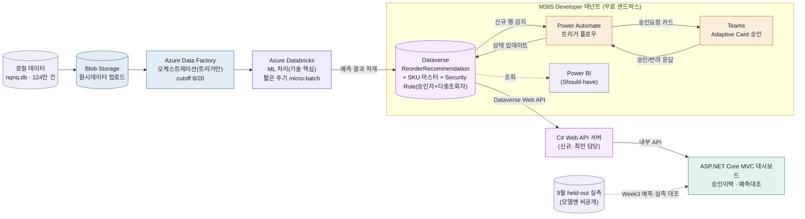

## 2. 데이터 흐름 4단계 요약
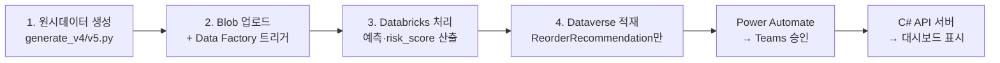

## 3. ERD — 핵심 트랜잭션 엔티티 (원본: [[62-erd]], 전체 필드는 [[61-entity-dictionary]])
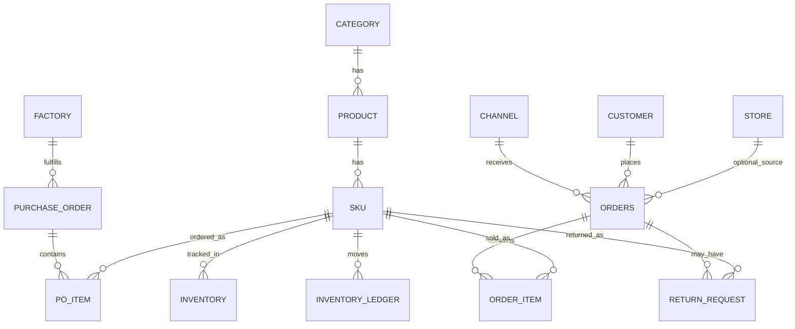

## 4. 팀 조직 & 역할 (2026-09-14 확정, 원본: [[21-system-model]] 롤별 담당표)
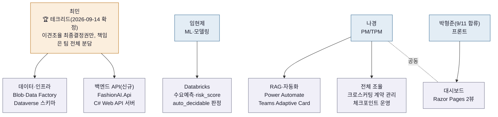

## 3-1. 데이터 프레임(기획 문서) 구조 — DB 엔티티와 다른 레이어 (원본: `30-data/31-nqnq-frame` 폴더)
> 위 3번은 **데이터베이스 엔티티** 관계도이고, 이건 그 엔티티들이 어떤 **기획 논리**로 도출됐는지 담은 문서 묶음 자체의 구조다. 브랜드 결정 → 카탈로그 설계 → 공급망/세일즈 조건 → 조직/워크플로우 → (마지막에) 기술 데이터 모델, 순서로 위에서 아래로 논리가 이어진다.

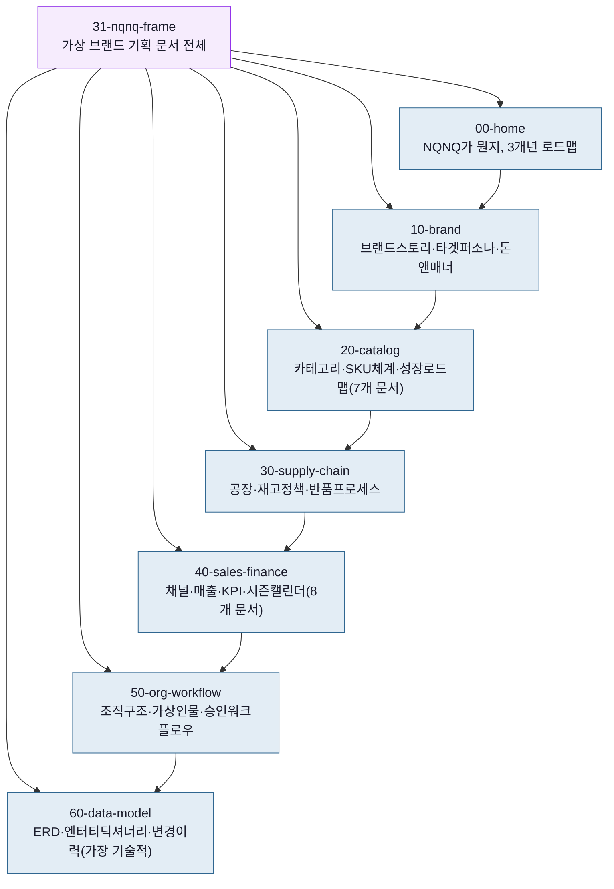

## 5. 승인 워크플로우 (원본: [[54-approval-workflow]])
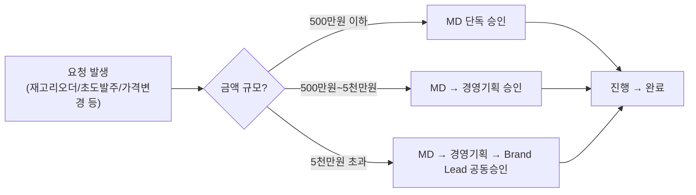

### 5-1. (신규 스트레치) 담당자 부재 시 자동 의사결정 — 원본: [[25-execution-design]] 2-5절
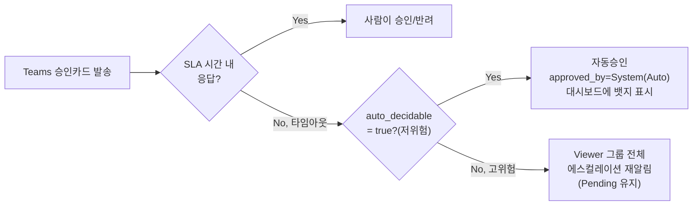

## 6. 프로젝트 타임라인 (원본: [[1-execution-plan]])
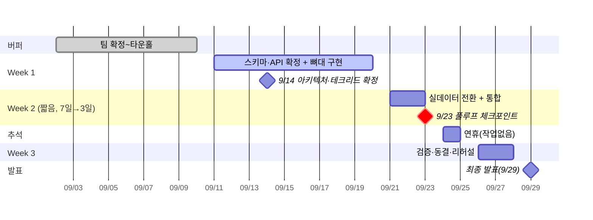

## 7. 기능 우선순위 티어 (원본: [[3-feature-backlog]])
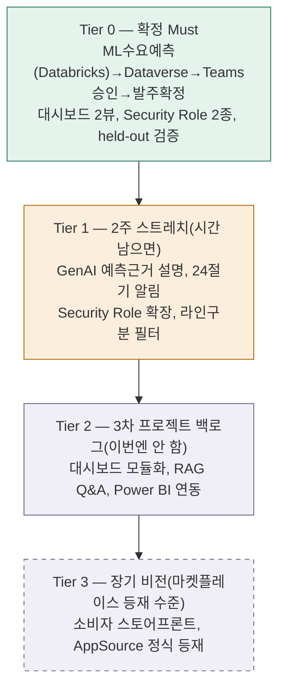

## 8. 카테고리 · SKU 분류체계 (원본: [[21-core-categories]], [[22-sku-code-system]])
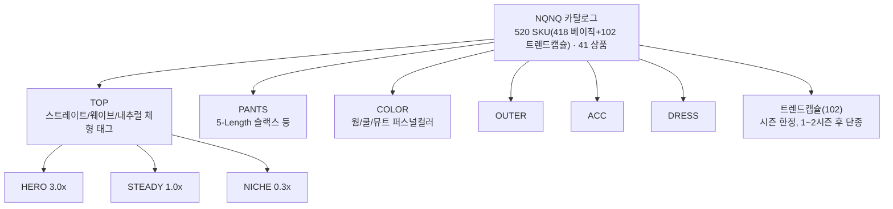

## 9. 비용/인프라 레이어 (원본: [[23-cost-plan]])
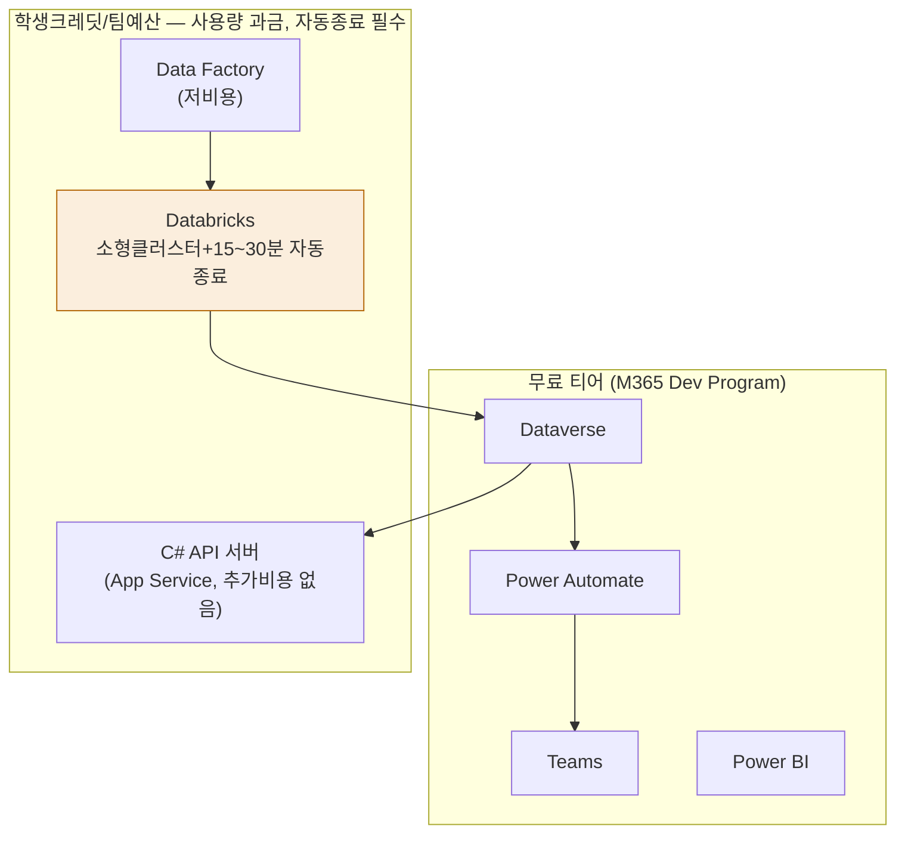

---

## 다이어그램 목록 (텍스트 인덱스)
| # | 다이어그램 | 원본 문서 |
| --- | --- | --- |
| 1 | 전체 시스템 아키텍처 | [[21-system-model]] |
| 2 | 데이터 흐름 4단계 | [[21-system-model]] |
| 3 | ERD | [[62-erd]] / [[61-entity-dictionary]] |
| 3-1 | 데이터 프레임(기획 문서) 구조 | `31-nqnq-frame` 폴더 |
| 4 | 팀 조직·역할 | [[21-system-model]] |
| 5 | 승인 워크플로우 (+자동의사결정) | [[54-approval-workflow]] / [[25-execution-design]] |
| 6 | 프로젝트 타임라인 | [[1-execution-plan]] |
| 7 | 기능 우선순위 티어 | [[3-feature-backlog]] |
| 8 | 카테고리·SKU 분류체계 | [[21-core-categories]] / [[22-sku-code-system]] |
| 9 | 비용/인프라 레이어 | [[23-cost-plan]] |
