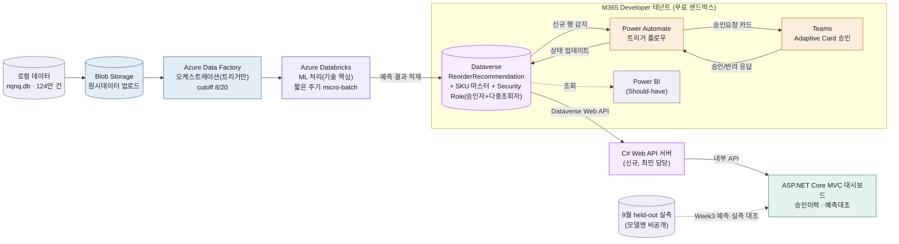

> 관련 문서: [[1-kickoff-brief]] · [[23-cost-plan]] · [[22-feature-spec]] · [[3-feature-backlog]]
> 전체 시각화 모음은 [[20-visual-overview]] — 이 문서는 그 원본(텍스트 설명)이다.

## 서론

**만드는 것**: SAP 등 기존 ERP는 건드리지 않고, Databricks+Data Factory로 수요를 예측해서 Dataverse 발주추천→Teams 승인 액션으로 연결하는 **AI 재고 리플레니시먼트 PoC**(가칭 Fashion AI Agent Appservice). NQNQ는 실제 제품이 아니라 이 PoC를 검증하기 위한 가상 브랜드(가상 주문 데이터 소스, [[1-basic-frame|30-data]] 참고).

**왜 만드는가**: 패션 상품은 판매 데이터→MD 확인→회의→검토→결정→실행까지 거치며 **의사결정이 늦어진다(Decision Latency)**. 이 시스템은 그 사이 단계를 데이터 수집→수요예측→재고위험 탐지→**Decision Recommendation**(`ReorderRecommendation`)→담당자 승인→실행으로 줄인다. 완전자동화가 아니라 **사람이 최종 승인하는 의사결정 지원**이 원칙 — 이유는 [부록 A](#부록-a--genai-예측근거-설명-스트레치-tier1-코어-완료-후)의 XAI 과신(over-reliance) 근거 참고.

**지금 단계**: 2차 프로젝트(9/11~9/28, 실질 약 2.5주) — 아래 본론이 이번에 실제로 만드는 범위 전부다. 장기 비전(GenAI 마케팅, ESG 확장 등)은 부록으로만 보존.

---

## 본론

### 1. 핵심 엔진 (2개)
| 엔진                        | 내용                                                                                                                                                                                                |
| ------------------------- | ------------------------------------------------------------------------------------------------------------------------------------------------------------------------------------------------- |
| ① Databricks 수요예측·자동발주 추천 | Data Factory가 Databricks 노트북을 오케스트레이션 → SKU별 수요 예측(짧은 주기 micro-batch) → 품절위험 SKU는 Dataverse `ReorderRecommendation`으로 자동 생성([[22-feature-spec]] 필드 정의) → 9월 held-out 데이터로 정확도 검증([[82-ppt-plan]]) |
| ② Teams 승인 코파일럿           | 원래 상시 RAG 챗봇 구상이었으나 2차 스코프에서는 **Power Automate + Teams Adaptive Card 승인 워크플로우**로 축소. 예측→발주추천→카드 승인요청→클릭 한 번으로 확정. 정책 질의응답형 RAG는 Tier 2 백로그([[3-feature-backlog]])                                 |

> ~~③ GenAI 마케팅 콘텐츠 생성~~은 2차 스코프에서 완전 제외 — [부록 B](#부록-b--장기-백로그-2차-스코프-완전-밖)에만 보존.

### 2. 시스템 아키텍처

*(2026-09-14 확정: 원시데이터는 Blob 경유, 대시보드는 최민님의 C# API 서버를 거쳐서만 Dataverse 접근 — 상세는 [[25-execution-design]] 4절)*

대시보드는 2뷰만 구현(승인이력/예측대조, 2026-09-10 Razor Pages 전환), 별도 서빙 레이어 없이 Dataverse 단일 저장소 — 비용 원칙은 [[23-cost-plan]].

### 3. 롤별 담당 (2026-09-14 확정)
**테크리드: 최민** — 이견 조율의 최종 결정권만 가지며, 구현 결과 책임은 팀 전체가 분담([[1-kickoff-brief]] 8절).

| 기능 영역 | 담당 컴포넌트 | 담당자 |
| --- | --- | --- |
| 데이터 파이프라인 | Blob 업로드 + Data Factory 오케스트레이션 | 최민 |
| Azure 인프라 | Dataverse 스키마 + Security Role | 최민 |
| 백엔드 API(신규) | C# Web API 서버(`FashionAI.Api`) | 최민 |
| RAG·자동화 | Power Automate + Teams Adaptive Card | 나경 |
| ML·모델링 | Databricks 처리, risk_score, 클러스터 관리 | 임현제 |
| 대시보드·프론트 | Razor Pages 2뷰 | 나경·박형준(9/11 합류) |
| 전체 조율 | 크로스커팅 계약·체크포인트·발표자료 | 나경 |

---

## 결론

**확정된 것** — 이번 스코프에서 안 바뀜:
- 핵심 엔진 2개(예측/승인), 대시보드 2뷰, Dataverse는 결과 저장 전용
- 테크리드 최민, C# API 서버 신설, Blob 경유 아키�텍처

**아직 열린 것** (다음 회의 안건):
- [ ] Teams 카드에 예측근거 자연어 설명(GenAI) 붙일지 — [부록 A](#부록-a--genai-예측근거-설명-스트레치-tier1-코어-완료-후) 참고, 코어 배포 후 착수
- [ ] 부록 A 내 "MAI 대화형 후속 질의" 확장까지 갈지 — 코어와 완전 분리된 독립 스트레치

---

## 부록 A — GenAI 예측근거 설명 스트레치 (Tier1, 코어 완료 후)
> 채택 여부 미정 — 채택 시 아래 구조로 시작. 참고: 무신사 [MATCH Console & MAI](https://techblog.musinsa.com/match-console-mai-e65b2cfd687e)의 ReAct 패턴, 토스 [LLM 맥락 기반 주제 분류](https://toss.tech/article/llm_context_topic)의 Structured Output 원칙.

**목표**: Teams 카드에 "왜 이 SKU가 위험한지"를 risk_score 숫자 대신/추가로 1~2문장 자연어로 덧붙임.

**파이프라인 (ReAct 축소판)**
1. **탐색**: risk_score 근거 데이터 조회 — 최근 판매속도, 재고소진일, 계절 민감도([[64-real-world-grounding]]), 프로모션 유무. [[61-entity-dictionary]] ERD의 엔티티 관계를 순회하는 구조라 사실상 그래프 기반 근거 탐색(GraphRAG류) — 새 그래프 DB 불필요
2. **생성**: 근거를 프롬프트에 주입 → **Structured Output**(`{"summary","key_factor","confidence"}`)으로 제한, 카드 필드에 그대로 매핑
3. **검증**: `key_factor`가 실제 피처 중요도 상위 3개 안에 있는지 대조 — hallucination 방지 최소 안전장치

**왜 완전 자동생성이 아닌가**: Human-in-the-loop 원칙 그대로 — 설명은 "참고용 1줄"만, 승인/반려는 사람. XAI 연구에서 설명이 "과신(over-reliance)"을 유발할 수 있다는 근거 — [Explain To Decide: XAI in AI-assisted Decision Making](https://arxiv.org/pdf/2312.11507)(arXiv). 학술 원본: Yao et al., ["ReAct"](https://react-lm.github.io/), ICLR 2023.

**의존성**: Azure OpenAI 학습 여부([[2-tech-research]]), risk_score 공식 확정([[24-alert-rules]]).

### MAI 대화형 후속 질의 — 추가 심화안 (완전 독립 스트레치)
기본안(정적 1줄) 위에 "더 물어보기" 버튼을 얹어 MD가 자유 질문하면 같은 ReAct 파이프라인으로 답하는 확장. 코어 MVP 배포·QA 완료 후에만 착수 — 순서 바뀌면 안 됨. 무신사 MAI를 발표에서 벤치마킹 사례로 인용 가능([[4-differentiation-ideas]]).

---

## 부록 B — 장기 백로그 (2차 스코프 완전 밖)
> NQNQ를 실제 제품처럼 서술하지만 "도입 회사가 언젠가 이 수준까지 확장한다면"이라는 장기 가정. [[3-feature-backlog]] Tier 3.

- **GenAI 마케팅**: 체형별 카피라이팅 자동생성, AI 모델 룩북 시뮬레이션
- **Smart OS 5단계**: 기획→생산→마케팅→입고/판매→피드백, 단계마다 유관부서 @태그 자동연동
- **확장 대시보드**: Overview/ML Forecast/AI Marketing Studio/RAG Workspace 4탭 + AI Alert Zone + RAG 챗봇 패널
- **ESG/디지털 제품 패스포트 로드맵(Year2/3)**: 원본은 `90-startup-grant`의 [[92-esg-dpp-roadmap]]·[[93-year2-detail]] — 여기서 재서술 안 함
- **다층 의사결정 구조 + 분석 데이터마트(Star-schema)**: "이해관계자가 같은 데이터를 권한만큼 다르게 본다"는 부분만 이미 채택(Security Role 다중화, [[4-differentiation-ideas]] 논의 2) — 나머지(의사결정 유형별 ML 자동화, `dim_*`/`fact_*` 데이터마트)는 Year2 정식 검토. 데이터마트를 지금 안 넣는 이유: 원본이 일반 ERP/POS 용어 기준이라 NQNQ 실제 스키마([[61-entity-dictionary]])와 네이밍이 어긋남
