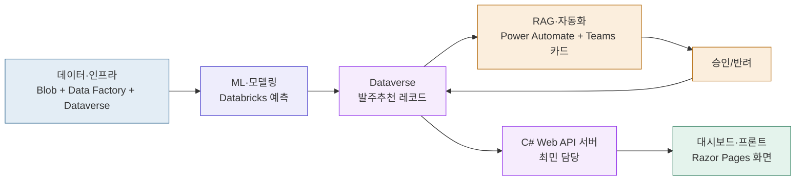

> 관련 문서: [[83-demo-scenarios]] · [[22-feature-spec]] · [[82-ppt-plan]] · [[04.MS-DataSchool/20.PROJECT/22.MS_2nd_Project/00-wbs/03-meetings/2026-09-07-kickoff-call]]
> **상태**: 🌱 초안 — 확정 아님. 9/7 회의 액션아이템("최종 개발했을 때 기대하는 산출물? 결과물에 대한 정의") 대응.
> **원칙**: "다 만들었다"를 뭘로 증명할지를 역할별 + 전체 통합, 두 층위로 정의.

## 한눈에 보기 (전체 흐름도)

> 전체 다이어그램(Blob·API 서버 포함 최신)은 [[21-system-model]] 2절이 원본. 아래는 역할 관점 요약만.

이 화살표 하나하나가 실제로 눈에 보이게 동작해야 "완성"이다. 각 역할이 만들어야 할 것을 구체적으로 정의하면 아래와 같다.

---

## 1. 역할별 산출물 (이걸 만들면 "그 역할은 끝난 것")

### 데이터·인프라 (최민)
| 산출물 | 완료 기준(눈으로 확인 가능한 상태) |
| --- | --- |
| Data Factory 파이프라인 | 실행하면 nqnq.db → cutoff(8/20) 기준 학습용 데이터셋이 실제로 뽑혀 나옴 |
| Dataverse `ReorderRecommendation` 테이블 | Power Apps에서 테이블 열어보면 7개 필드(sku_code, predicted_demand, recommended_qty, risk_score, status, created_at, approved_by)가 실제로 존재 |
| Security Role 2종 | `Reorder Approver`로 로그인하면 승인 버튼이 보이고, `Viewer`로 로그인하면 읽기만 됨 |
| held-out(9월) 데이터 | `generate_v4.py` 확장 스크립트로 9월 데이터가 별도 생성돼 있고, 학습 데이터와 섞이지 않음 |

### ML·모델링 (임현제)
| 산출물                         | 완료 기준                                      |
| --------------------------- | ------------------------------------------ |
| Databricks 노트북(피처 엔지니어링~학습) | 노트북을 처음부터 끝까지 실행하면 예측 모델이 만들어짐             |
| risk_score 계산 로직            | SKU를 넣으면 숫자 하나(위험도 점수)가 나옴                 |
| Dataverse 적재                | 계산된 예측값·risk_score가 실제로 Dataverse 테이블에 채워짐 |
| 예측-실측 오차율 스크립트              | 9월 held-out 데이터와 비교해서 "오차 몇 %"라는 숫자가 나옴    |

### RAG·자동화 (나경, 2026-09-11 확정)
| 산출물 | 완료 기준 |
| --- | --- |
| Power Automate 플로우 | Dataverse에 새 발주추천 레코드가 생기면, 자동으로 Teams 카드가 날아감 |
| Teams Adaptive Card | 카드에 SKU명·risk_score·추천수량이 보이고, 승인/반려 버튼이 실제로 동작 |
| 승인 → 상태 업데이트 | 카드에서 승인 누르면 Dataverse의 `status`가 Approved로 바뀜 |

### 대시보드·프론트 (나경, 2026-09-11~09-16 박형준 공동 담당 기간 있었음)
| 산출물 | 완료 기준 |
| --- | --- |
| 승인이력 뷰 | 지금까지 승인/반려된 발주추천 목록이 화면에 보임 |
| 예측대조 뷰 | 9월 예측값 vs 실측값을 그래프로 비교해서 보여줌 |
| (Should) Power BI 연동 | 시간 남으면 Dataverse 데이터를 Power BI로도 조회 가능하게 |

### 백엔드 API (최민, 신규 2026-09-14)
| 산출물 | 완료 기준 |
| --- | --- |
| `FashionAI.Api` | 4개 엔드포인트가 Swagger에서 실제로 호출되고 Dataverse 데이터를 JSON으로 반환 |

---

## 2. 전체 통합 산출물 (역할 다 합쳐서 최종적으로 보여줄 것)

| 산출물                | 설명                                                                    | 대응 시나리오                        |
| ------------------ | --------------------------------------------------------------------- | ------------------------------ |
| **라이브 데모**         | 품절위험 SKU 예측 → Dataverse 발주추천 → Teams 승인 → 발주확정, 이 전체 흐름을 화면 공유로 실제 실행 | [[83-demo-scenarios]] 시나리오 1 |
| **예측 정확도 검증 리포트**  | 9월 held-out 대조 오차율 수치 + 시각화 그래프                                       | 시나리오 2                         |
| **발표 슬라이드 + 스크립트** | 7단계 발표 구조([[82-ppt-plan]] 참고), 20분 분량                                | —                              |
| **소스코드 저장소**       | Data Factory·Databricks·Dataverse·Power Automate·C# API 서버·Razor Pages 코드 전체 | —                              |
| **최종 보고서**         | 프로젝트 진행 과정·결과 요약 문서                                                   | —                              |

---

## 3. 시간 남으면 추가할 산출물 (스트레치)
- [[83-demo-scenarios]] B그룹(반품율 알림 등) — 기존 파이프라인 재사용이라 비용 낮음
- C그룹(RAG 대화형 질의) — RAG 담당 확정되면 검토

---

## 다음에 정할 것
- [x] RAG·자동화, 대시보드·프론트 담당자 확정 (4인 회의) ✅ 2026-09-11
- [ ] 위 "완료 기준" 표를 팀 전체가 리뷰하고 이견 있으면 수정
- [ ] 각 완료 기준을 [[04.MS-DataSchool/20.PROJECT/22.MS_2nd_Project/00-wbs/01-docs/2-schedule]]의 담당자별 작업과 매칭
